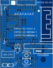

<h2>PCB v1.0</h2>

First production version, contains the following hardware:
- ESP32-S3 WI-FI/BT module
- LDO converter +5V to +3.3V
- Onboard programmable LED
- Reset & Boot buttons
- Expansion headers
- USB Type-C port
- Micro SD Card connector
- LCD ST7789 10p connector
- LCD backlight control circuit
- Input voltage measurement circuit
- I2S decoder and amplifier
- PDM MEMS microphone

Top|Bottom
-|-
|

***NOTE:** If the device is used without any expansion boards, pins VIN and +5V must be shorted with a jumper.*
