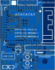
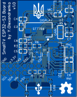

<h2>PCB v1.0</h2>

First production version, contains the following hardware:
- ESP32-S3 WI-FI/BT module
- LDO converter +5V to +3.3V
- Onboard programmable LED
- Reset & Boot buttons
- Expansion headers
- Ready for up to 4 touch buttons
- USB Type-C port
- Micro SD Card connector
- LCD ST7789 10p connector
- LCD backlight control circuit
- Input voltage measurement circuit
- I2S decoder and amplifier
- PDM MEMS microphone

Top|Bottom
-|-
|

***NOTE:** If the device is used without any expansion boards, pins VIN and +5V must be shorted with a jumper.*

<h3>ESP32-S3 module connections</h3>

#|Pin|HW|Signal|Component
:-:|:-:|:-:|:-:|-
1|GND|Ground|GND|Ground circuit
2|3V3|Power|+3.3V|Power circuit
3|EN|Reset|RES|Reset circuit
4|GPIO4|ADC|IO4|Touch button 0
5|GPIO5|ADC|IO5|Toush button 1
6|GPIO6|ADC|IO6|Toush button 2
7|GPIO7|ADC|IO7|Touch button 3
8|GPIO15|I2S|DIN|Speaker amplifier
9|GPIO16|I2S|BCLK|Speaker amplifier
10|GPIO17|I2S|RLCLK|Speaker amplifier
11|GPIO18|PDM|CLK|Microphone
12|GPIO8|PDM|DATA|Microphone
13|GPIO19|USB|D-|USB connector
14|GPIO20|USB|D+|USB connector
15|GPIO3|ADC|-|Input voltage measurement circuit
16|GPIO46|-|-|-
17|GPIO9|GPIO|RES|Display
18|GPIO10|SPI|CS|Display
19|GPIO11|SPI|MOSI|Display
20|GPIO12|SPI|SCK|Display
21|GPIO13|GPIO|DC|Display
22|GPIO14|PWM|BL|Display backlight circuit
23|GPIO21|MMC|D1|SD Card
24|GPIO47|GPIO|DET|SD Card detect circuit
25|GPIO48|-|-|-
26|GPIO45|-|-|-
27|GPIO0|GPIO|BOOT/LED|Boot button / LED circuit
28|GPIO35|-|-|-
29|GPIO36|-|-|-
30|GPIO37|-|-|-
31|GPIO38|MMC / SPI|CMD / MOSI|SD Card
32|GPIO39|MMC / SPI|D3 / CS|SD Card
33|GPIO40|MMC|D2|SD Card
34|GPIO41|MMC / SPI|CLK / SCK|SD Card
35|GPIO42|MMC / SPI|D0 / MISO|SD Card
36|GPIO43|UART|RXD|Expansion port
37|GPIO44|UART|TXD|Expansion port
38|GPIO2|I2C|SDA|Expansion port
39|GPIO1|I2C|SCL|Expansion port
40|GND|Ground|GND|Ground circuit
